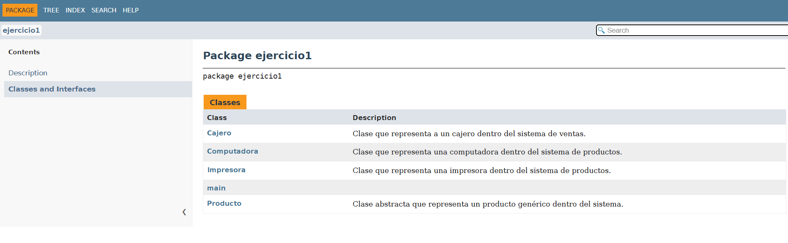

# 🖥️ Tienda Informática - Sistema de Gestión de Productos

## Descripción
Proyecto en Java que simula el funcionamiento básico de una **tienda informática**, permitiendo gestionar productos como **computadoras** e **impresoras**, calcular precios finales según sus características y mantener control sobre el **stock** y la **venta de productos** a través de un **cajero**.  

_Incluye documentación generada con **JavaDoc**._

---

## Estado del Proyecto
 **Completado y funcional**  
 Estructura modular y documentada  
 Incluye pruebas y ejemplos básicos  

---

## Características Principales
- Clase abstracta `Producto` como base para otros tipos de productos.  
- Subclases `Computadora` e `Impresora` con atributos y cálculos de precio personalizados.  
- Clase `Cajero` que permite calcular el precio final según cantidad y tipo de producto.  
- Validaciones de stock y cantidad con manejo de excepciones (`IllegalArgumentException`).  
- Documentación completa en formato HTML generada con **JavaDoc**.

---

## Tecnologías Utilizadas
- **Lenguaje:** Java
- **Entorno:** JDK + Git Bash
- **Documentación:** JavaDoc  
- **Control de versiones:** Git / GitHub  

---

## Instalación / Requisitos Previos
1. Tener instalado **JDK 17 o superior**.  
2. Clonar el repositorio:
   ```bash
   git clone https://github.com/juaneguia/tiendaInformaticaDoc.git
3. Navegar al directorio del proyecto:
   ```bash
   cd tiendaInformaticaDoc
4. Compilar las clases:
   ```bash
   javac src/ejercicio1/*.java
 
## Uso
Podés ejecutar la aplicación desde la línea de comandos o integrarla a un entorno IDE (Eclipse, VS Code con extensión de Java).
Ejemplo básico:
```java
Producto compu = new Computadora(1000, "ASUS", 5, "TUF Gaming", 16, 512, true);
Cajero cajero = new Cajero("Juan", compu, 2);
System.out.println("Precio Final: " + cajero.calcularPrecioFinal());
```
```bash
Precio Final: 2200.0
```
## Ejemplos / Capturas
Documentación JavaDoc  
Abrir el archivo doc/index.html en el navegador para ver la documentación completa del proyecto.



## Autor
Juan Manuel Eguía  
juanma.eguia@gmail.com  
Argentina

## Licencia
Este proyecto está bajo la licencia MIT.  
Proyecto desarrollado con fines académicos para prácticas de POO (Programación Orientada a Objetos) y documentación JavaDoc.
